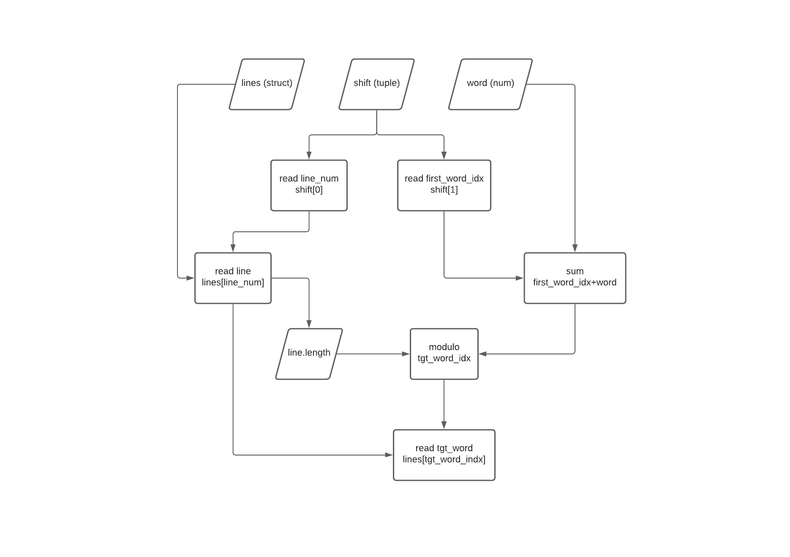

## Dataflow Patterns

1. There are two pieces of code that compute the word associated with a cirular shift. Find them:
 
    ```py
    # snippet 1 - from the Alphabetizer

    def csword(shift, wordno, lines):
    (lno, first_word_no) = shift
    shift_idx = (first_word_no + wordno) % len(lines[lno])

    return lines[lno][shift_idx]
    ```

    ```py
    # snippet 2 - from the output module

    lines[lno][(i+first_word_no) % wrd_cnt]
    ```

2. These two snippets of code have the same dataflow graph. What is it? Draw it if you can.



3. How would you go about finding code in other programs that follows the circular-shift pattern? i.e.: what would you look for when skimming the code? (You can't use the dataflow graph directly, but you can be inspired by it.)

I would look for:
- sum of indexes followed by modulo operation to ensure "wrapping" of array index - in this case word indexes
- using above result as an index into an array - in this case a "line" structure (array of words)

<br/>

## Data-Centric Refactoring

1. For each module of the code: What secret is it hiding? That is, what design decisions are contained in that module, where changing the design decision could not change any other module.

- **Input Module:** This module does NOT hide the design of the `line_storage` data structure, which is made available to all other modules via a global variable. Any changes to this design will affect _all_ other modules. 
It could be argued that it hides the input format from the other modules as this _could_ be changed and then still converted to the line-storage format without changing other modules.

- **Circular Shifter:** Nothing of consequence is hidden by this module. In a similar fashion to  the input module, the circular shifter does NOT hide its most important design decision since it makes the `circ_index` data structure directly available to other modules, exposing the storage mechanism and the relationship between the line data and the shifted data to other modules. Changes to this design will affect the alphabetizer. 

- **Alphabetizing module:** Method access level aside, the sort algorithm is not currently visible to module consumers. However, it does NOT hide its most important design decision - the alphabetized index data structure - which is used directly by the output module. This exposes the ordering and enforces that the ordering is performed upfront.

- **Output Module:** The module does NOT hide the output format, which is printed - although the exact method is not visible to the caller except in the name. None of the other modules currently use knowlege of the output module.

<br/>

2. Consider each of the following design changes. What code would need to change for each?

- Use of persistent storage (not in-memory) for the line storage

    Each module references the `line_storage` structure directly, so all modules would have to be changed to reference the new storage method

- Using on-demand instead of up-front alphabetization. (I.e.: Using a selection algorithm instead of a sorting algorithm.)

    The output module references the current `alph_index` directly so this would have to change to call the new interface (assuming alphbetization on fetch, rather incremental alphebetisation on insert)

- Storing shifts in byte-packed arrays

    The circular shifter and alphabetizer modules both reference the `circular_index` structure directly, so would both have to change. Arguably, since the `alph_index` is of the same structure, only sorted, it may also change, having a knock-on effect on the output module also.

<br/>

3. Separate each of `lines_storage`, `circ_index`, `alph_index` into their own "module," with an abstracted accessor interface. Each should not be accessed from outside that module.

- The line-storage module:

    ```py
    class LineStore:

    # Swapped get_char, set_char for get_word, set_word for convenience
    def get_word(line_num, word_num, word):
        # retrieves word from storage struct

    def set_word(line_num, word_num, word):
        # inserts word into storage struct

    def words(line_num):
        # return the number of words on a given line

    def lines():
        # return the total number of lines stored

    def delete_line(line_num):
        # deletes specifiec line from storage struct

    def delete_word(line_num, word_num):
        # deletes specifed word from storage struct
    ```

- The circular-shifter module:

    ```py
    class CircularShifter:
    __init__(self, line_store: LineStore):
        self.__line_store = line_store
        self.__circ_index = []
        for line_num in range line_store.lines():
        for word_num in range line_store.words(line_num)
            self.__circ_index.append( (line_num, word_num) )

    # Swapped `char()` for `word()` for convenience in this illustration
    def word(shift_num, word_num):
        line_num = self.__circ_index[shift_num][0] 
        i = word_num % self.__line_store.words(line_num)
        
        return self.__line_store.word(line_num, i)

    def num_words(shift_num):
        return self.__line_store.words(shift_num)

    def shifts():
        return len(self.__circ_index)
    ```

- The alphabetizer module:

    ```py
    class Alphabetizer:
    __init__(self, circ_shifter: CircularShifter):
        self.circ_shifter = circ_shifter
        shifts = range(circ_shifter.shifts())
        self.__alph_index = sorted(shifts, key=functools.cmp_to_key(cmp_csline))
    
    @ staticmethod
    def cmp_csline(shift1, shift2) # these are just indexes to be passed to circ_index
        nwords1 = circ_shifter.num_words(shift1)
        nwords2 = circ_shifter.num_words(shift2)
        lasti = min(nwords1, nwords2)

        for i in range(lasti+1):
        cword1 = circ_shifter.word(shift1, i)
        cword2 = circ_shifter.word(shift2, i)

        if cword1 != cword2:
            return cmp(cword1, cword2)
        
        return cmp(nwords1, nwords2)

    def ith(i):
        return self.__alph_index[i]
    ```

4. Refactor the code so that (1) the storage format of the input, and (2) the format of circular shifts are both now secrets. In particular, there should now be only one instance of the pattern you identified in question 2 of the previous exercise.

    ```py
    ####################################################################
    # INPUT MODULE (would extract to own class)

    import copy
    from kwic-q3 import LineStore
    from kwic-q3 import CircularShifter
    from kwic-q3 import Alpahbetizer

    def putfile(linelist)
    line_store = LineStore(linelist)

    lines = copy.copy(lineList)
    for l, line in enumerate(lines):
        for w, word in enumerate(line):
        line_store.set_word(l, w, word)

    return line_store
        
    ######################################################################
    ## OUTPUT MODULE (would extract to own class)

    def print_all_alph_cs_lines():
    for shift_num in alph_index
        for word_num in range(circ_index.words(shift_num))
        print circ_index.word(shift_num, word_num)

    ######################################################################

    ## MASTER CONTROL
    line_store = putfile([
    ["a", "b", "c", "d"],
    ["one"],
    ["hey", "this", "is", "different"],
    ["a", "b", "c", "d"]
    ])
    circ_index = CircularShifter(line_store)
    alph_index = Alphabetizer(circ_index)
    print_all_alph_cs_lines(circ_index, alph_index)

    ```

<br/>

5. For each module of the _refactored_ code: What secret is it hiding? That is, what design decisions are contained in that module, where changing the design decision could not change any other module.

- **Input Module:** Input format is "hidden" from other modules as the input data is inserted into the `LineStore` module through the interface it specifies. Other modules interact with the data only through the interface defined by `LineStore`, which returns only specified values, without leaking details of the storage mechanism. Thus other modules are not affected by changes to the input format or the storage mechanism.

- **Circular Shifter:** The details of how shifts and words relate to the original line-numbers and how they are stored are hidden by the `CircularShifter` module. Other modules are only able to interact with the circular-shift data via the `CircularShifter` interface which, in a similar fashion to `LineStore`, returns only specified values without leaking details of the storage mechanism. Whilst `CircularShifter` has a dependency on `LineStore`, it does not know its internal details.

- **Alphabetizing module:** The index of a particular shift `i` in the order 0 to i is obtained via the `ith(i)` method, which hides the details of the storage of these data. Again the details of the algorithm for determining the order are hidden (as was the case for the first version), although the actual method itself is not private since we are using Python. There is a dependency between the data of `CircularShifter` and `Alphabetizer` since the latter returns an shift-index at position `i` to be used to access the actual shift from the former. However, the actual details of the data contained within each are hidden from the other.

- **Output Module:** Clearly the name of the main method of the output module makes it clear that the output format is printed, although the actual mechanism is hidden. All interaction with the data is performed through the `CircularShifter` and `Alphbetizer` modules, which are supplied as arguments to modules main function, but without the caller knowing how they will be used.

<br/>

6. Consider each of the following design changes. What code would need to change for each?

- Use of persistent storage (not in-memory) for the line storage

    Since other modules insert and retrieve line-data via the interface exposed by `LineStore` without knowledge of how it is stored, only the `LineStore` would need to change if the line-storage mechanism were to change.

- Using on-demand instead of up-front alphabetization. (i.e.: Using a selection algorithm instead of a sorting algorithm.)

    Since other modules only interact with the alphetized data via the `ith` method of the `Alphabetizer`, the stored order of the shift-indexes is unknown to the caller. Therefore the shift-indexes could be stored out-of-order and the order determined only when calling `ith` with no change required in other modules.

- Storing shifts in byte-packed arrays

    The storage details of the shifts are hidden by the `CircularShifter` module and all other modules are only able to interact with these data through its interface, leaving the storage of the shifts free to change without affecting other modules, provided its interface is honoured.